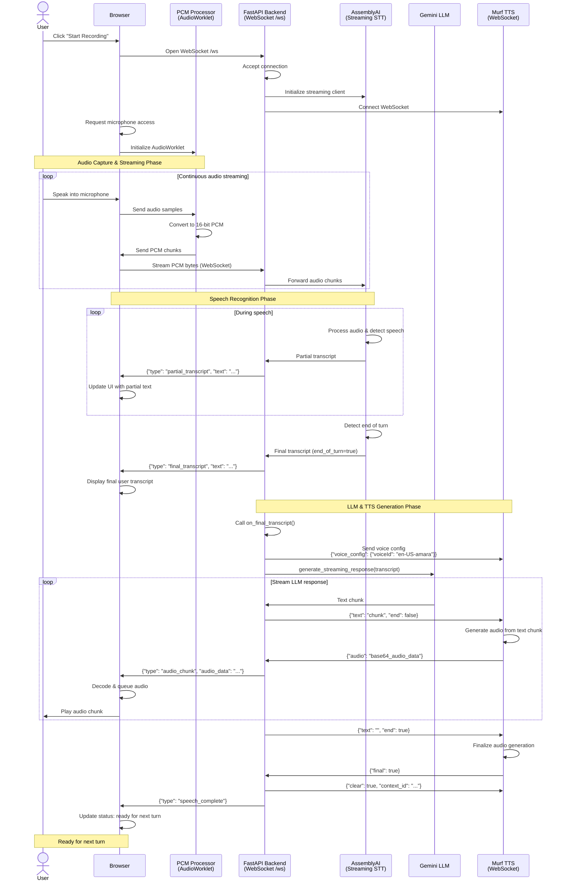
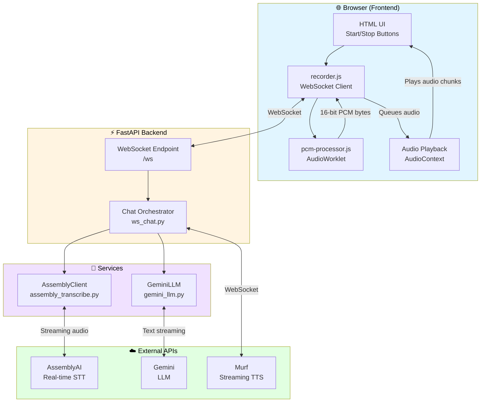

# Voice Agent Architecture Diagram

## Complete Workflow - One Conversation Turn

```mermaid
sequenceDiagram
    actor User
    participant Browser
    participant PCMProcessor as PCM Processor<br/>(AudioWorklet)
    participant FastAPI as FastAPI Backend<br/>(WebSocket /ws)
    participant Assembly as AssemblyAI<br/>(Streaming STT)
    participant Gemini as Gemini LLM
    participant Murf as Murf TTS<br/>(WebSocket)

    User->>Browser: Click "Start Recording"
    Browser->>FastAPI: Open WebSocket /ws
    FastAPI->>FastAPI: Accept connection
    FastAPI->>Assembly: Initialize streaming client
    FastAPI->>Murf: Connect WebSocket

    Browser->>Browser: Request microphone access
    Browser->>PCMProcessor: Initialize AudioWorklet

    Note over User,PCMProcessor: Audio Capture & Streaming Phase

    loop Continuous audio streaming
        User->>Browser: Speak into microphone
        Browser->>PCMProcessor: Send audio samples
        PCMProcessor->>PCMProcessor: Convert to 16-bit PCM
        PCMProcessor->>Browser: Send PCM chunks
        Browser->>FastAPI: Stream PCM bytes (WebSocket)
        FastAPI->>Assembly: Forward audio chunks
    end

    Note over Assembly,Browser: Speech Recognition Phase

    loop During speech
        Assembly->>Assembly: Process audio & detect speech
        Assembly->>FastAPI: Partial transcript
        FastAPI->>Browser: {"type": "partial_transcript", "text": "..."}
        Browser->>Browser: Update UI with partial text
    end

    Assembly->>Assembly: Detect end of turn
    Assembly->>FastAPI: Final transcript (end_of_turn=true)
    FastAPI->>Browser: {"type": "final_transcript", "text": "..."}
    Browser->>Browser: Display final user transcript

    Note over FastAPI,Murf: LLM & TTS Generation Phase

    FastAPI->>FastAPI: Call on_final_transcript()
    FastAPI->>Murf: Send voice config<br/>{"voice_config": {"voiceId": "en-US-amara"}}

    FastAPI->>Gemini: generate_streaming_response(transcript)

    loop Stream LLM response
        Gemini->>FastAPI: Text chunk
        FastAPI->>Murf: {"text": "chunk", "end": false}
        Murf->>Murf: Generate audio from text chunk
        Murf->>FastAPI: {"audio": "base64_audio_data"}
        FastAPI->>Browser: {"type": "audio_chunk", "audio_data": "..."}
        Browser->>Browser: Decode & queue audio
        Browser->>User: Play audio chunk
    end

    FastAPI->>Murf: {"text": "", "end": true}
    Murf->>Murf: Finalize audio generation
    Murf->>FastAPI: {"final": true}

    FastAPI->>Murf: {"clear": true, "context_id": "..."}
    FastAPI->>Browser: {"type": "speech_complete"}
    Browser->>Browser: Update status: ready for next turn

    Note over User,Browser: Ready for next turn
```

## High-Level Component Architecture

```mermaid
graph TB
    subgraph Browser["🌐 Browser (Frontend)"]
        UI[HTML UI<br/>Start/Stop Buttons]
        Recorder[recorder.js<br/>WebSocket Client]
        PCM[pcm-processor.js<br/>AudioWorklet]
        Playback[Audio Playback<br/>AudioContext]
    end

    subgraph Backend["⚡ FastAPI Backend"]
        WS[WebSocket Endpoint<br/>/ws]
        Orchestrator[Chat Orchestrator<br/>ws_chat.py]
    end

    subgraph Services["🔧 Services"]
        AssemblyClient[AssemblyClient<br/>assembly_transcribe.py]
        GeminiLLM[GeminiLLM<br/>gemini_llm.py]
    end

    subgraph External["☁️ External APIs"]
        AssemblyAI[AssemblyAI<br/>Real-time STT]
        Gemini[Gemini<br/>LLM]
        MurfAPI[Murf<br/>Streaming TTS]
    end

    UI --> Recorder
    Recorder --> PCM
    PCM -->|16-bit PCM bytes| Recorder
    Recorder <-->|WebSocket| WS
    WS --> Orchestrator

    Orchestrator --> AssemblyClient
    Orchestrator --> GeminiLLM

    AssemblyClient <-->|Streaming audio| AssemblyAI
    GeminiLLM <-->|Text streaming| Gemini
    Orchestrator <-->|WebSocket| MurfAPI

    Playback -->|Plays audio chunks| UI
    Recorder -->|Queues audio| Playback

    style Browser fill:#e1f5ff,color:#000
    style Backend fill:#fff4e1,color:#000
    style Services fill:#f0e1ff,color:#000
    style External fill:#e1ffe1,color:#000
```
